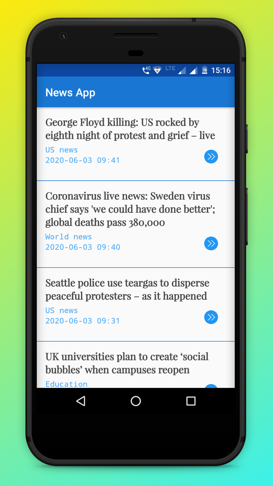
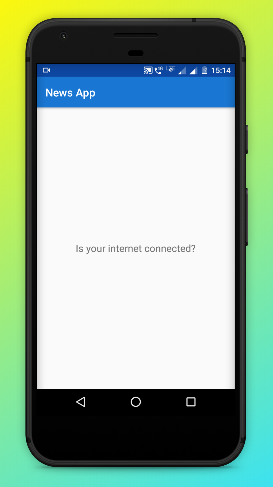

# News-App
 Android Basics by Google Nanodegree Program - Udacity
## Project Overview
The final project combines everything learned in the "Networking" lesson of the Nanodegree program. This app connects to the Internet to provide news articles from the "GUardian API". The News app gives a user regularly-updated news from the Internet related to a various topics, persons, or locations. 

This project is about combining various ideas and skills practiced throughout the course. They include:

- Connecting to an API
- Parsing the JSON response
- Handling error cases gracefully
- Updating information regularly
- Using an AsyncTask
- Doing network operations independent of the Activity lifecycle
- Use Uri.Builder class to add query parameters to the URL

## Screenshots
     

Demo of the app is available at <a href="demo/demo.gif">here.
